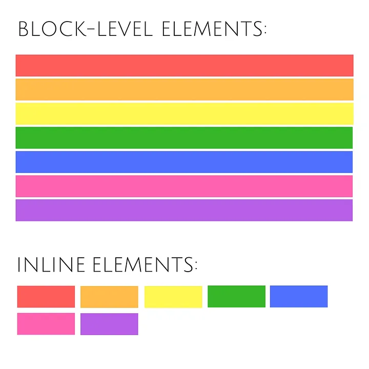

# HTML

### HTML

> Hypertext Markup Language (HTML) is the standard markup language for documents designed to be displayed in a web browser. It defines the content and structure of web content. It is often assisted by technologies such as Cascading Style Sheets (CSS) and scripting languages such as JavaScript, a programming language.

- Hyper Text Markup Language
- > Hypertext: Refers to the connections between pages through hyperlinks.
- > Markup: Defines the page layout and elements within the page.
- > Language: Combines both features to create Hypertext Markup Language.
- markup language for creating Web pages
- describes the structure of a Web page
- consists of a series of elements
- elements label pieces of content such as "this is a heading", "this is a paragraph", "this is a link", etc.
- The `<!DOCTYPE html>` declaration defines that this document is an HTML5 document
- The `<html>` element is the root element of an HTML page
  The `<head>` element contains meta information about the HTML page
  > > Note: Some HTML elements have no content (like the `<br>` element). These elements are called empty elements. Empty elements do not have an end tag!

> Note: The content inside the `<body>` section will be displayed in a browser. The content inside the `<title>` element will be shown in the browser's title bar or in the page's tab.

### Disadvantages of HTML

- HTML can be used to create only static Web-page, it can not create dynamic web-page.
- There is a lack of security in HTML.
- Creating a simple Web-page required so many tags.
- HTML language is not centralized i.e. all the web pages that are connected, you have to design them separately else need to use CSS.
- HTML becomes complex when you try to create a huge website.

## Head Tag - `<head></head>`

- The HTML `<head>` element is a container for the following elements: `<title>, <style>, <meta>, <link>, <script>, and <base>`.
- HTML metadata is data about the HTML document. Metadata is not displayed.

- Metadata typically define the document title, character set, styles, scripts, and other meta information.
  Some of the common elements that are included within the head tag include:

- `<title>`: This element is used to define the title of the document, which is displayed in the browser's title bar and is often used by search engines to describe the page.
- `<meta>`: This element is used to define metadata about the document, such as the character encoding, description of the page, keywords, and author.
- `<link>`: This element is used to link to external resources, such as stylesheets or scripts, that are used to format or enhance the page.
- `<script>`: This element is used to define JavaScript code that is executed on the page.

### How can I use the head tag in SEO?

The head tag in HTML can be used to optimize a webpage for SEO. Here are some key elements that affect your SEO:

- Use the `<title>` tag: The title tag is one of the most important elements for SEO. It should be placed within the head tag and should contain the main keywords that describe the page's content. The title should be concise, descriptive, and no longer than 70 characters.
- Add meta descriptions: The meta description is a brief summary of the page's content and can be displayed in the search results below the title. Although meta descriptions don’t directly affect a page’s rankings, meta descriptions can be used to increase click-through rates. The meta description should be placed within the head tag and should be no longer than 160 characters.
- Use canonical tags: The canonical tag is used to avoid duplicate content issues and should be placed within the head tag. It specifies the preferred version of a URL when there are multiple versions of the same content.
- Use `robots.txt`: The robots.txt file is used to control which pages on a website are indexed by search engines. It should be placed in the root directory of the website and linked to in the head tag using the title tag.

### meta - `<meta>`

> Meta tags provide metadata about the HTML document, such as the character set, page description, keywords, author, and viewport settings for responsive design. They are important for SEO, accessibility, and ensuring proper rendering on different devices.

To refresh document every 30 seconds:

- > `<meta http-equiv="refresh" content="30">  `
  > Meta refresh is used to provide instructions to the browser to automatically refresh the page after the given time interval. As in above example it will automatically refresh after 30 sec

- `<meta http-equiv="refresh" content="10; url=https://www.javatpoint.com/html-head>`
  If you add an URL with content value, then it will redirect to that page after the time limit will over.

## Block vs Inline

### Block-level Elements

- > A block-level element always starts on a new line, and the browsers automatically add some space (a margin) before and after the element.

- > A block-level element always takes up the full width available (stretches out to the left and right as far as it can).
- block level elements create larger structures (than inline elements).

Two commonly used block elements are: `<p>` and `<div>`.

The `<p>` element defines a paragraph in an HTML document.

The `<div>` element defines a division or a section in an HTML document.

Here are the block-level elements in HTML:

`<address><article><aside><blockquote><canvas><dd><div><dl><dt><fieldset><figcaption><figure><footer><form><h1>-<h6><header><hr><li><main><nav><noscript><ol><p><pre><section><table><tfoot><ul><video>`

### Inline Elements

- > An inline element does not start on a new line.

- > An inline element only takes up as much width as necessary.

- This is a <span> element inside a paragraph.

Here are the inline elements in HTML:

`<a><abbr><acronym><b><bdo><big><br><button><cite><code><dfn><em><i><input><kbd><label><map><object><output><q><samp><script><select><small><span><strong><sub><sup><textarea><time><tt><var>`

> > Note: An inline element cannot contain a block-level element!

### Inline elements:

- respect left & right margins and padding, but not top & bottom
- cannot have a width and height set
- allow other elements to sit to their left and right.

### Block elements:

- respect all of those
- force a line break after the block element
- acquires full-width if width not defined

### Inline-block elements:

- allow other elements to sit to their left and right
- respect top & bottom margins and padding
- respect height and width

### Flowchart



# table

The `<table>` tag in HTML is used to create a table structure for organizing data into rows and columns. It provides a way to present tabular data in a clear, organized manner, making it easy for users to read and interpret the information.

A basic table consists of the following main elements:

- `<table>`: The container tag for the entire table.
- `<tr>`: Represents a row in the table.
- `<td>`: Represents a cell in the table (data cell).
- `<th>`: Represents a header cell (usually bold and centered by default).
- `<caption>` (optional): Provides a title or description for the table.

Importance of the <table> Tag

- Data Representation:Tables are ideal for representing structured data such as schedules, financial reports, comparisons, and statistics.
- Organized Layout:They provide an easy-to-read format by visually separating data into rows and columns.
- Accessibility:Screen readers and assistive technologies can interpret tables to provide a meaningful experience for visually impaired users when semantic elements like `<thead>, <tbody>, <tfoot>` are used.

```html
<table class="center">
  <tr>
    <th>Month</th>
    <th>Savings</th>
  </tr>
  <tr>
    <td>January</td>
    <td>$100</td>
  </tr>
  <tr>
    <td>February</td>
    <td>$80</td>
  </tr>
</table>
```

What does colspan= do?
Allows a single table cell to span the width of more than one cell or column.
What does rowspan= do?
Allows a single table cell to span the height of more than one cell or row.
Why use colspan= or rowspan=?
Sometimes it makes sense for a cell to span multiple columns or multiple rows. This might be used for a header cell that titles a group of columns, or a side-bar that groups rows of entries.

Both colspan= and rowspan= are attributes of the two table-cell elements, `<th>` and `<td>`. They provide the same functionality as “merge cell” in spreadsheet programs like Excel.

The value of either attribute must be a positive integer (a whole number). The value specifies the number of columns or rows that the cell fills.

```html
<table>
  <caption>
    Life Expectancy By Current Age
  </caption>
  <tr>
    <th colspan="2">65</th>
    <th colspan="2">40</th>
    <th colspan="2">20</th>
  </tr>
  <tr>
    <th>Men</th>
    <th>Women</th>
    <th>Men</th>
    <th>Women</th>
    <th>Men</th>
    <th>Women</th>
  </tr>
  <tr>
    <td>82</td>
    <td>85</td>
    <td>78</td>
    <td>82</td>
    <td>77</td>
    <td>
      <table>
        <caption>
          Life Expectancy By Current Age
        </caption>
        <tr>
          <th colspan="2">65</th>
          <th colspan="2">40</th>
          <th colspan="2">20</th>
        </tr>
        <tr>
          <th>Men</th>
          <th>Women</th>
          <th>Men</th>
          <th>Women</th>
          <th>Men</th>
          <th>Women</th>
        </tr>
        <tr>
          <td>82</td>
          <td>85</td>
          <td>78</td>
          <td>82</td>
          <td>77</td>
          <td>81</td>
        </tr>
      </table>
      81
    </td>
  </tr>
</table>
```

```html
<table>
  <caption>
    Invoice
  </caption>
  <tr>
    <th>Item / Desc.</th>
    <th>Qty.</th>
    <th>@</th>
    <th>Price</th>
  </tr>
  <tr>
    <td>Paperclips (Box)</td>
    <td>100</td>
    <td>1.15</td>
    <td>115.00</td>
  </tr>
  <tr>
    <td>Paper (Case)</td>
    <td>10</td>
    <td>45.99</td>
    <td>459.90</td>
  </tr>
  <tr>
    <td>Wastepaper Baskets</td>
    <td>2</td>
    <td>17.99</td>
    <td>35.98</td>
  </tr>
  <tr>
    <th colspan="3">Subtotal</th>
    <td>610.88</td>
  </tr>
  <tr>
    <th colspan="2">Tax</th>
    <td>7%</td>
    <td>42.76</td>
  </tr>
  <tr>
    <th colspan="3">Total</th>
    <td>653.64</td>
  </tr>
</table>
```

## accept only jpg

```html
<form action="/upload" method="post" enctype="multipart/form-data">
  <label for="fileInput">Upload a .jpg file:</label>
  <input type="file" id="fileInput" name="file" accept=".jpg, image/jpeg" />
  <button type="submit">Upload</button>
</form>
```

## marquee

The `<marquee>` tag in HTML creates a scrolling text or image effect within a webpage. It allows content to move horizontally or vertically across the screen, providing a simple way to add dynamic movement to elements.

> HTML `<marquee>` tag is used to create auto scrolling or moveable element within webpage.

```html
<marquee height="100" direction="left">this is content</marquee>
```

## sematic vs non-semantic

| Semantic elements                                               | Non-Semantic elements                                          |
| --------------------------------------------------------------- | -------------------------------------------------------------- |
| They have meaning                                               | They don’t have meaning                                        |
| They describe how the content within them is supposed to behave | They can contain anything                                      |
| They have specific attributes for their structure               | The ‘class’ attribute can be used to work with their structure |


# picture
The <picture> tag gives web developers more flexibility in specifying image resources.

The most common use of the `<picture>` element will be for art direction in responsive designs. Instead of having one image that is scaled up or down based on the viewport width, multiple images can be designed to more nicely fill the browser viewport.

```html 
<picture>
  <source media="(min-width:650px)" srcset="img_pink_flowers.jpg">
  <source media="(min-width:465px)" srcset="img_white_flower.jpg">
  
</picture>
```


## new 
What is Lazy Loading?
- Lazy loading (also known as deferred loading) is the action of only loading necessary page assets as they are needed with the purpose of conserving system resources and improving overall speed and performance. 

- In terms of images, lazy loading means that any image not immediately needed will not load until it is called for. 

- It works by adding attributes to the original content.

- By deferring image loading until needed, web pages are able to load quicker with just the immediately-needed images. 

- Images on the page that aren’t in the users’ window of view will be filled with a placeholder image until needed.

- If you’re an instagram user, you’ve probably seen this feature several times before. Next time you use Instagram, visit a popular page and notice that photos do not load until a user scrolls down to where those photos are. 

What is Eager Loading?
- Whereas lazy loading takes its time loading images, eager doesn’t have the same patience.

- Eager loading is the action of force-loading all the assets on a page at once. It loads related entities, even if the visitor never scrolls down to it. 

- You may have seen eager loading in action before as well. If you have ever visited a page with a lot of photos or videos that displayed a loading screen, that’s eager loading. 

- Eager loading allows you to load all of your resources at once, but it can lead to much slower speeds and increased bandwidth and resource usage. 