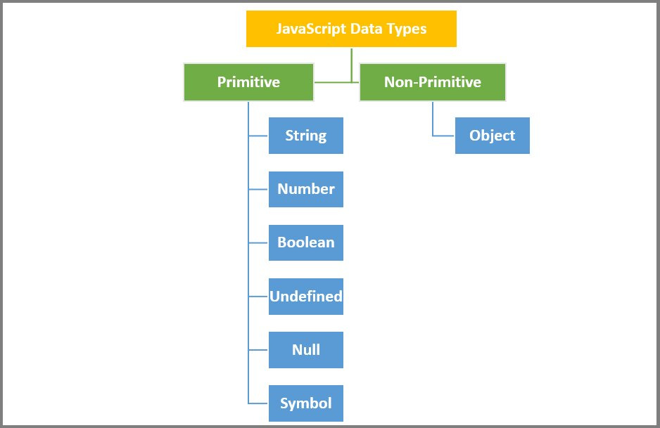
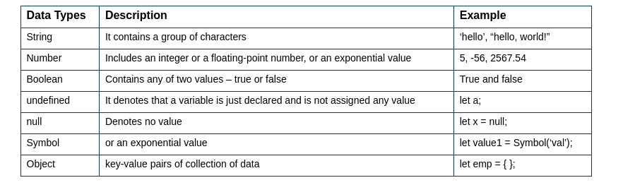

# Javascript

1.What is javascript?
JavaScript is a scripting language that enables you to create dynamically updating content, control multimedia, animate images, and pretty much everything else. (Okay, not everything, but it is amazing what you can achieve with a few lines of JavaScript code.)

> > JavaScript is a lightweight, cross-platform, single-threaded, and interpreted compiled programming language. It is also known as the scripting language for webpages

- > JavaScript is a weakly typed language (dynamically typed). JavaScript can be used for Client-side developments as well as Server-side developments.
- > JavaScript is the Programming Language for the Web.

- > JavaScript can update and change both HTML and CSS.

- > JavaScript can calculate, manipulate and validate data.

> > "Client-side" means code executes on the user's computer, rather than on the server. This makes JavaScript load faster than server-side languages like PHP or ASP,JSP.

## JS is Single Threaded Language

What is a Single-Threaded Language?
To understand why JavaScript is single-threaded, we first need to define what it means for a language to be single-threaded. A single-threaded language is one that can execute only one task at a time. The program will execute the tasks in sequence, and each task must complete before the next task starts. Other languages, like Python or Java, are multi-threaded and can execute multiple tasks simultaneously.

What are Threads?

- Threads are lightweight processes that run concurrently within a program. Each thread has its own stack and executes independently but shares resources such as memory, code, and data with other threads. Multithreading allows a program to perform several tasks simultaneously, which is useful for running heavy computations or handling multiple requests in a web application.

Why is JavaScript Single Threaded?

- JavaScript was designed to be a single-threaded language because of the nature of the environment in which it runs – the browser. When JavaScript was created in 1995, the primary use case was to add interactivity to static web pages. At that time, computers were much slower than they are today, and the amount of processing power available was limited. To keep the language simple and efficient, JavaScript was made single-threaded.

What are the Implications of JavaScript Being Single-Threaded?

- The fact that JavaScript is single-threaded has several implications on web development. One of the most significant implications is that long-running tasks can block the execution of other code. For example, if a script takes several seconds to execute, other scripts on the page will not run until that script has completed. This can result in slow and unresponsive web pages.

How Can We Work Around the Limitations of JavaScript Being Single-Threaded?

- There are several ways to work around the limitations of JavaScript being single-threaded. One approach is to use asynchronous programming techniques, such as callbacks, promises, and async/await. Asynchronous programming allows us to perform long-running tasks without blocking the execution of other code.

- Another approach is to use web workers, which are a type of JavaScript thread that runs in the background. Web workers allow us to execute heavy computations or I/O operations without blocking the main thread, resulting in a more responsive user interface.

### FAQs

Q1: Is JavaScript always single-threaded?

- Yes, JavaScript is always single-threaded, except when using web workers, which are a type of JavaScript thread that runs in the background.

Q2: What is the difference between synchronous and asynchronous programming?

- Synchronous programming blocks the execution of other code until a task completes, while asynchronous programming allows other code to continue executing while a task is running.

Q3: Why is it important to understand the limitations of JavaScript's single-threaded nature?

- Understanding the limitations of JavaScript's single-threaded nature is essential to building fast and responsive web applications.

Q4: Can we use multithreading in JavaScript?

- No, JavaScript does not support multithreading, but it does support web workers, which are a type of JavaScript thread that runs in the background.

Q5: How do web workers work?

- Web workers are a type of JavaScript thread that runs in the background and allows us to execute heavy computations or I/O operations without blocking the main thread.

### Can we add script in head?
-  Yes, you can add a `<script>` tag inside the `<head>` element, but the execution happens before the `DOM` is fully loaded, which can block rendering.
- Yes, we can add script in head tag.
- Although our HTML will be valid if we use a `<script>` element in either the `<head>` or `<body>`element, we normally want to put our `<script>` elements before our closing `</body>` tag instead of in the `<head>` element. We do this because if one of our `<scripts>` fails to load, any content on our page physically lower than the failing `<script>` may not render or will error if we are trying to manipulate an element that doesn’t exist yet in the DOM. We could be left with a blank page with no HTML or styling! Also, if we are waiting for our `<script>` to download, the rest of the content on our page will have to wait to render until our `<script>` is loaded. It’s better practice to put our `<script>` elements before the closing </body> tag to make sure all our our HTML content is read/rendered by the browser before trying to apply JavaScript.

In head this will not work

```js
<script>
      const h1 = document.getElementById("h1");
      const btn = document.getElementById("btn");
      btn.addEventListener("click", () => {
        h1.style.color = "#fefefe";
      });
</script>
```


 ### Does adding a `<script>` tag in the `<head>` element cause any problem?


- Adding scripts in the `<head>` can delay the loading of the page because the browser stops rendering the HTML until the script is fully downloaded and executed.
- Solution: Use async or defer attributes or move the script to the end of the `<body>`.

## Datatype

JavaScript has 8 Datatypes

- String
- Number
- Bigint
- Boolean
- Undefined
- Null
- Symbol
- Object

```js
let str = "Hello"; // String
let num = 42; // Number
let isTrue = true; // Boolean
let bigNum = 123n; // BigInt
let value = undefined; // Undefined
let empty = null; // Null
let unique = Symbol("id"); // Symbol
let obj = { key: "value" }; // Object

 ```





## defer vs async

Special Link - [script-link"](https://medium.com/helpshift-engineering/javascript-loading-strategies-normal-vs-async-vs-defer-930285016803)


### async:
- Downloads the script asynchronously while the HTML continues parsing.
- Executes the script immediately after it’s loaded, without waiting for the HTML to finish parsing.
- Useful for scripts that are independent of other scripts or DOM.

```html
<script async src="script.js"></script>
```
### defer:
 - Downloads the script asynchronously but delays execution until the HTML parsing is complete.
 - Maintains the order of execution for multiple scripts.
 - Ideal for scripts that depend on a fully parsed DOM.
```html
<script defer src="script.js"></script>
```

|Attribute|Execution Timing|Order of Execution |
|-----|-----|-----|
|async|	As soon as it’s loaded|	No guaranteed order|
|defer|	After HTML is parsed|	In the script order|


```html
    <script async src="super-high-priority.js"></script>
    <script defer src="general-stuff.js"></script>
```

```html
<script       src="myscript.js"></script> // 1

<script async src="myscript.js"></script> // 2

<script defer src="myscript.js"></script> // 3
```


---

### What is hoisting? Give examples.
- Definition: Hoisting is JavaScript's default behavior of moving declarations to the top of the scope before code execution.

 - Explanation -> Only declarations `(var, function)` are hoisted, not initializations.
- `let` and `const` are hoisted but remain in a temporal dead zone until they are initialized.
 
Examples:
```js
console.log(a); // undefined (due to hoisting)
var a = 10;

// Using `let` or `const`:
console.log(b); // ReferenceError
let b = 20;
```

### What is closure? Give examples.
- Definition: A closure is a function that remembers the variables from its outer scope, even after the outer function has executed.
 - Explanation:
 - Closures allow you to create private variables.
 - > Use cases: Encapsulation, callbacks, event listeners, etc.
Example:
```js
function outer() {
    let count = 0;
    return function inner() {
        count++;
        console.log(count);
    };
}
const counter = outer();
counter(); // 1
counter(); // 2
```
## What is stale closure? Give examples.

> Definition: A stale closure occurs when a closure captures outdated values because the outer function's variables have been overwritten or modified after the closure is created.


```js
function createCounters() {
    let counters = [];
    for (var i = 0; i < 3; i++) {
        counters.push(() => console.log(i));
    }
    return counters;
}
const counters = createCounters();
counters[0](); // 3
counters[1](); // 3
counters[2](); // 3

```

> The closure captures the reference to i, not its value.

 - Fix using let:
```js
for (let i = 0; i < 3; i++) {
    counters.push(() => console.log(i));
}
```
Output:
```bash
0
1
2
```

---

### **11. Explain currying, its use case, and its benefits.**
- **Category**: Functional Programming
- **Definition**:
  - Currying is a technique of **transforming a function** that takes multiple arguments into a series of functions that each take a single argument.
- **Example**:
  ```javascript
  function add(a) {
      return function (b) {
          return function (c) {
              return a + b + c;
          };
      };
  }

  console.log(add(1)(2)(3)); // Output: 6
  ```
- **Use Cases**:
  - Reusability: Create partially applied functions.
  - Modular code: Break down functions into smaller pieces.
- **Benefits**:
  - Enhanced code readability.
  - Avoids repetition by creating reusable functions.
- **Sources**: [JavaScript.info](https://javascript.info/currying-partials)

---

### **12. What is an IIFE?**
- **Category**: Function Execution
- **Definition**:
  - **IIFE (Immediately Invoked Function Expression)** is a function that is executed immediately after it is defined.
- **Example**:
  ```javascript
  (function () {
      console.log("IIFE executed!");
  })();
  ```
- **Purpose**:
  - Avoid polluting the global scope.
  - Encapsulate private variables.
- **Sources**: [MDN Docs](https://developer.mozilla.org/en-US/docs/Glossary/IIFE)

---

### **13. Give 4 ways to create an IIFE.**
- **Category**: Function Syntax
- **Examples**:
  1. **Using Parentheses**:
     ```javascript
     (function () {
         console.log("Method 1");
     })();
     ```
  2. **Using Unary Operator**:
     ```javascript
     +function () {
         console.log("Method 2");
     }();
     ```
  3. **Using Arrow Functions**:
     ```javascript
     (() => {
         console.log("Method 3");
     })();
     ```
  4. **Using New Operator**:
     ```javascript
     new function () {
         console.log("Method 4");
     }();
     ```
- **Sources**: [GeeksforGeeks](https://www.geeksforgeeks.org/)

---

### **14. What are operators in JavaScript?**
- **Category**: Programming Basics
- **Explanation**:
  - Operators perform actions on operands (values/variables).
  - **Types of Operators**:
    1. **Arithmetic**: `+`, `-`, `*`, `/`, `%`, `**`
    2. **Comparison**: `==`, `!=`, `===`, `!==`, `>`, `<`, `>=`, `<=`
    3. **Logical**: `&&`, `||`, `!`
    4. **Bitwise**: `&`, `|`, `^`, `~`, `<<`, `>>`
    5. **Assignment**: `=`, `+=`, `-=`, `*=`, `/=`
    6. **Ternary**: `condition ? expr1 : expr2`
- **Example**:
  ```javascript
  let a = 5, b = 3;
  console.log(a + b); // 8 (Arithmetic)
  console.log(a > b); // true (Comparison)
  console.log(a && b); // 3 (Logical)
  ```
- **Sources**: [MDN Operators](https://developer.mozilla.org/en-US/docs/Web/JavaScript/Reference/Operators)

---

### **15. How can I check the data type of variables in JavaScript?**
- **Category**: Type Checking
- **Ways to Check Data Type**:
  1. **Using `typeof`**:
     ```javascript
     console.log(typeof "Hello"); // string
     console.log(typeof 42); // number
     console.log(typeof null); // object
     ```
  2. **Using `instanceof`**:
     ```javascript
     let arr = [];
     console.log(arr instanceof Array); // true
     ```
  3. **Using `Object.prototype.toString.call`**:
     ```javascript
     console.log(Object.prototype.toString.call([])); // [object Array]
     ```
  4. **Custom Type Check (for arrays)**:
     ```javascript
     console.log(Array.isArray([])); // true
     ```
- **Sources**: [StackOverflow](https://stackoverflow.com/questions/tagged/javascript)


Yeh rahe agle 5 questions ke answers, detailed explanation ke saath:

---

### **21. What are `call`, `bind`, and `apply`?**
- **Category**: Function Methods
- **Definition**:
  - These are methods in JavaScript that allow you to explicitly set the `this` context for a function.
- **Differences**:
  1. **`call`**: Invokes a function immediately with a specified `this` value and arguments passed **individually**.
     ```javascript
     function greet(greeting) {
         console.log(`${greeting}, ${this.name}`);
     }
     const person = { name: "Amresh" };
     greet.call(person, "Hello"); // Output: Hello, Amresh
     ```
  2. **`apply`**: Similar to `call`, but arguments are passed as an **array**.
     ```javascript
     greet.apply(person, ["Hi"]); // Output: Hi, Amresh
     ```
  3. **`bind`**: Creates a new function with `this` bound to a specific object; does not execute immediately.
     ```javascript
     const boundGreet = greet.bind(person);
     boundGreet("Hey"); // Output: Hey, Amresh
     ```
- **Use Cases**:
  - Borrowing methods from other objects.
  - Explicitly controlling the function’s context.
- **Sources**: [MDN call/bind/apply](https://developer.mozilla.org/en-US/docs/Web/JavaScript/Reference/Global_Objects/Function)

---

### **22. Explain what is the `new` keyword.**
- **Category**: Object Creation
- **Definition**:
  - The `new` keyword is used to create an instance of an object that inherits properties and methods from a constructor function.
- **How It Works**:
  1. Creates a new empty object.
  2. Sets the prototype of the object to the constructor’s `prototype`.
  3. Executes the constructor function with `this` pointing to the new object.
  4. Returns the new object.
- **Example**:
  ```javascript
  function Person(name) {
      this.name = name;
  }
  const person = new Person("Amresh");
  console.log(person.name); // Output: Amresh
  ```
- **Sources**: [GeeksforGeeks](https://www.geeksforgeeks.org/)

---

### **23. What are prototypes in JavaScript?**
- **Category**: Object Inheritance
- **Definition**:
  - A prototype is a mechanism by which objects in JavaScript inherit properties and methods from other objects.
- **Explanation**:
  - Every object has an internal property `[[Prototype]]`, which refers to the prototype of its constructor.
  - The prototype chain is used to resolve property/method access.
- **Example**:
  ```javascript
  function Person(name) {
      this.name = name;
  }
  Person.prototype.sayHello = function () {
      console.log(`Hello, ${this.name}`);
  };

  const person = new Person("Amresh");
  person.sayHello(); // Output: Hello, Amresh
  ```
- **Sources**: [JavaScript.info Prototypes](https://javascript.info/prototype-inheritance)

---

### **24. Explain the difference between `__proto__`, `prototype`, and `[[Prototype]]`.**
- **Category**: Object Prototype
- **Explanation**:
  1. **`__proto__`**:
     - A legacy accessor property that points to the object’s internal `[[Prototype]]`.
     - Used for accessing or modifying an object’s prototype.
     - Example:
       ```javascript
       const obj = {};
       console.log(obj.__proto__); // Points to Object.prototype
       ```
  2. **`prototype`**:
     - A property of constructor functions (e.g., `Function.prototype`).
     - Defines methods and properties shared by all instances of that constructor.
     - Example:
       ```javascript
       function Person() {}
       console.log(Person.prototype); // Prototype object
       ```
  3. **`[[Prototype]]`**:
     - An internal property that links an object to its prototype.
     - Accessible using `__proto__`.
- **Summary**:
  - `__proto__` is an accessor for `[[Prototype]]`, while `prototype` is a property of constructors.
- **Sources**: [MDN Prototypes](https://developer.mozilla.org/)

---

### **25. What is prototypical inheritance? How is it different from classical inheritance?**
- **Category**: Inheritance
- **Prototypical Inheritance**:
  - Objects inherit directly from other objects using their prototype chain.
  - JavaScript follows a prototype-based inheritance model.
  - Example:
    ```javascript
    const parent = { greet: () => console.log("Hello") };
    const child = Object.create(parent);
    child.greet(); // Output: Hello
    ```
- **Classical Inheritance**:
  - Used in languages like Java or C++.
  - Classes act as blueprints, and objects are instances of these classes.
  - Example (Java):
    ```java
    class Parent {
        void greet() {
            System.out.println("Hello");
        }
    }
    class Child extends Parent {}
    ```
- **Key Differences**:
  - Prototypical inheritance is more flexible and dynamic.
  - Classical inheritance is rigid and follows a strict hierarchy.
- **Sources**: [MDN Inheritance](https://developer.mozilla.org/en-US/docs/Learn/JavaScript/Objects/Inheritance)

---

Yeh rahe agle 5 questions ke detailed answers:

---

### **26. What is the difference between `var`, `let`, and `const`?**
- **Category**: Variable Declarations
- **Comparison**:

| Feature               | `var`                              | `let`                            | `const`                             |
|-----------------------|------------------------------------|-----------------------------------|-------------------------------------|
| **Scope**            | Function-scoped                   | Block-scoped                     | Block-scoped                       |
| **Re-declaration**   | Allowed                           | Not allowed                      | Not allowed                        |
| **Hoisting**         | Hoisted with `undefined`          | Hoisted but not initialized      | Hoisted but not initialized        |
| **Re-assignment**    | Allowed                           | Allowed                          | Not allowed                        |
| **Example**          | `var a = 10;`                     | `let b = 20;`                    | `const c = 30;`                    |

- **Explanation**:
  - **`var`**: Globally scoped or function-scoped. Redeclaration is allowed.
  - **`let`**: Preferred for mutable variables due to block scope.
  - **`const`**: Used for immutable variables. Reference types (e.g., objects) can have their contents modified but not reassigned.

- **Example**:
  ```javascript
  function testScope() {
      if (true) {
          var x = 10; // Function-scoped
          let y = 20; // Block-scoped
          const z = 30; // Block-scoped
      }
      console.log(x); // 10
      // console.log(y, z); // Error: y, z not defined outside block
  }
  ```

- **Sources**: [MDN Var, Let, Const](https://developer.mozilla.org/en-US/docs/Web/JavaScript/Reference/Statements/let)

---

### **27. What are Symbols in JavaScript?**
- **Category**: Primitive Data Type
- **Definition**:
  - Symbols are a unique and immutable primitive data type introduced in ES6.
  - Each Symbol value is unique, making it useful for creating unique property keys for objects.

- **Example**:
  ```javascript
  const sym1 = Symbol("description");
  const sym2 = Symbol("description");

  console.log(sym1 === sym2); // Output: false

  const obj = {};
  obj[sym1] = "Value";
  console.log(obj[sym1]); // Output: Value
  ```

- **Use Cases**:
  - Creating private object properties.
  - Avoiding property name collisions in objects.

- **Sources**: [MDN Symbols](https://developer.mozilla.org/en-US/docs/Web/JavaScript/Reference/Global_Objects/Symbol)

---

### **28. What is the spread and rest concept in JavaScript?**
- **Category**: ES6 Features
- **Spread Operator**:
  - Expands elements of an array or object.
  - Syntax: `...`
  - Example:
    ```javascript
    const arr = [1, 2, 3];
    const newArr = [...arr, 4, 5];
    console.log(newArr); // Output: [1, 2, 3, 4, 5]
    ```

- **Rest Operator**:
  - Combines multiple elements into an array.
  - Syntax: `...`
  - Example:
    ```javascript
    function sum(...nums) {
        return nums.reduce((a, b) => a + b, 0);
    }
    console.log(sum(1, 2, 3, 4)); // Output: 10
    ```

- **Difference**:
  - **Spread** is used for expanding.
  - **Rest** is used for gathering.

- **Sources**: [JavaScript.info Spread and Rest](https://javascript.info/rest-parameters-spread)

---

### **29. Explain destructuring.**
- **Category**: ES6 Features
- **Definition**:
  - A feature in JavaScript that allows unpacking values from arrays or properties from objects into distinct variables.

- **Examples**:
  1. **Array Destructuring**:
     ```javascript
     const arr = [1, 2, 3];
     const [a, b, c] = arr;
     console.log(a, b, c); // Output: 1, 2, 3
     ```
  2. **Object Destructuring**:
     ```javascript
     const obj = { name: "Amresh", age: 25 };
     const { name, age } = obj;
     console.log(name, age); // Output: Amresh 25
     ```

- **Use Cases**:
  - Simplifies access to deeply nested objects.
  - Makes function parameters more readable:
    ```javascript
    function greet({ name }) {
        console.log(`Hello, ${name}`);
    }
    greet({ name: "Amresh" }); // Output: Hello, Amresh
    ```

- **Sources**: [MDN Destructuring](https://developer.mozilla.org/en-US/docs/Web/JavaScript/Reference/Operators/Destructuring_assignment)

---

### **30. Explain the difference between `||` and `??`.**
- **Category**: Logical and Nullish Coalescing Operators
- **`||` (Logical OR)**:
  - Returns the first truthy value or the last value if all are falsy.
  - Falsy values include `false`, `null`, `undefined`, `0`, `NaN`, `""`.

- **`??` (Nullish Coalescing)**:
  - Returns the first value that is neither `null` nor `undefined`.
  - Does not consider `0`, `NaN`, or `""` as nullish.

- **Examples**:
  ```javascript
  console.log(null || "default"); // Output: "default"
  console.log(0 || "default"); // Output: "default"

  console.log(null ?? "default"); // Output: "default"
  console.log(0 ?? "default"); // Output: 0
  ```

- **Use Cases**:
  - Use `||` for fallback values where falsy values matter.
  - Use `??` for nullish checks.

- **Sources**: [JavaScript.info Nullish](https://javascript.info/nullish-coalescing-operator)

---


Yeh rahe agle 5 questions ke detailed answers:

---

### **31. What is optional chaining?**
- **Category**: ES11 Feature
- **Definition**:
  - Optional chaining (`?.`) is a feature in JavaScript that allows you to safely access deeply nested object properties, even if an intermediate property is `null` or `undefined`.
  
- **How It Works**:
  - Instead of throwing an error when trying to access a property on `null` or `undefined`, optional chaining returns `undefined`.

- **Example**:
  ```javascript
  const user = { name: "Amresh", address: { city: "Rohtak" } };

  console.log(user.address?.city); // Output: Rohtak
  console.log(user.phone?.number); // Output: undefined
  ```

- **Use Case**:
  - Prevents errors when accessing properties on objects that may not exist or are conditionally set.

- **Sources**: [MDN Optional Chaining](https://developer.mozilla.org/en-US/docs/Web/JavaScript/Reference/Operators/Optional_chaining)

---

### **32. What is functional programming?**
- **Category**: Programming Paradigm
- **Definition**:
  - Functional programming (FP) is a programming paradigm where functions are treated as first-class citizens. It focuses on immutability, pure functions, and higher-order functions.
  
- **Key Concepts**:
  - **Pure Functions**: Functions where the output is determined solely by the input, with no side effects.
  - **Immutability**: Data is never modified; instead, new data is returned.
  - **Higher-order Functions**: Functions that can take other functions as arguments or return functions.

- **Example**:
  ```javascript
  const add = (a, b) => a + b; // Pure function

  const numbers = [1, 2, 3];
  const doubledNumbers = numbers.map(num => num * 2); // Higher-order function
  console.log(doubledNumbers); // Output: [2, 4, 6]
  ```

- **Sources**: [MDN Functional Programming](https://developer.mozilla.org/en-US/docs/Glossary/Functional_programming)

---

### **33. What is the difference between `reduce` and `reduceRight`?**
- **Category**: Array Methods
- **Definition**:
  - Both `reduce` and `reduceRight` are methods in JavaScript for accumulating array values into a single result, but they differ in the direction in which the array is processed.

- **Difference**:
  - **`reduce()`**: Processes the array from left to right.
  - **`reduceRight()`**: Processes the array from right to left.

- **Example**:
  ```javascript
  const arr = [1, 2, 3, 4];
  
  const sumLeft = arr.reduce((acc, val) => acc + val, 0); // Left to right
  const sumRight = arr.reduceRight((acc, val) => acc + val, 0); // Right to left

  console.log(sumLeft); // Output: 10
  console.log(sumRight); // Output: 10
  ```

- **Sources**: [MDN Reduce](https://developer.mozilla.org/en-US/docs/Web/JavaScript/Reference/Global_Objects/Array/Reduce), [MDN ReduceRight](https://developer.mozilla.org/en-US/docs/Web/JavaScript/Reference/Global_Objects/Array/reduceRight)

---

### **34. What are callbacks?**
- **Category**: Asynchronous Programming
- **Definition**:
  - A **callback** is a function that is passed into another function as an argument and is executed after the completion of a task.
  
- **Example**:
  ```javascript
  function fetchData(callback) {
      setTimeout(() => {
          const data = { name: "Amresh" };
          callback(data); // Calling the callback function
      }, 1000);
  }

  fetchData((data) => {
      console.log(data); // Output: { name: "Amresh" }
  });
  ```

- **Use Case**:
  - Callbacks are commonly used in asynchronous functions, like reading files, making network requests, or handling events.

- **Sources**: [MDN Callbacks](https://developer.mozilla.org/en-US/docs/Glossary/Callback_function)

---

### **35. Explain inversion of control.**
- **Category**: Design Pattern
- **Definition**:
  - Inversion of Control (IoC) is a principle where the flow of control in a program is inverted, meaning that the control of objects or functions is transferred to a container or framework, rather than the program itself.

- **Example**:
  - **Dependency Injection** is a common form of IoC, where objects or services are injected into classes or functions.
  ```javascript
  class Database {
      connect() {
          console.log("Connecting to database...");
      }
  }

  class App {
      constructor(database) {
          this.database = database; // Database injected
      }
      start() {
          this.database.connect();
      }
  }

  const db = new Database();
  const app = new App(db); // Dependency Injection
  app.start();
  ```

- **Benefits**:
  - Promotes loose coupling and enhances testability.

- **Sources**: [Wikipedia Inversion of Control](https://en.wikipedia.org/wiki/Inversion_of_control)

---

Yeh rahe agle 5 questions ke detailed answers:

---

### **36. What are promises?**
- **Category**: Asynchronous Programming
- **Definition**:
  - A **promise** is an object that represents the eventual completion (or failure) of an asynchronous operation and its resulting value.

- **States of a Promise**:
  - **Pending**: The initial state of the promise.
  - **Fulfilled**: The operation was successful, and the promise has a resolved value.
  - **Rejected**: The operation failed, and the promise has a reason (error).

- **Example**:
  ```javascript
  const promise = new Promise((resolve, reject) => {
      const success = true;
      if (success) {
          resolve("Operation successful");
      } else {
          reject("Operation failed");
      }
  });

  promise.then((message) => console.log(message))  // Output: Operation successful
         .catch((error) => console.log(error));
  ```

- **Sources**: [MDN Promises](https://developer.mozilla.org/en-US/docs/Web/JavaScript/Reference/Global_Objects/Promise)

---

### **37. What are the different states of promises?**
- **Category**: Asynchronous Programming
- **Definition**:
  - A promise has three possible states:
    - **Pending**: The initial state before the promise is settled.
    - **Fulfilled**: The promise has been resolved with a value.
    - **Rejected**: The promise has been rejected with a reason (error).

- **Example**:
  ```javascript
  let promise = new Promise((resolve, reject) => {
      let success = true;
      if (success) {
          resolve("Success!");
      } else {
          reject("Error!");
      }
  });

  promise.then(response => console.log(response))  // Success!
         .catch(error => console.log(error));  // Error!
  ```

- **Sources**: [MDN Promise States](https://developer.mozilla.org/en-US/docs/Web/JavaScript/Reference/Global_Objects/Promise)

---

### **38. When does the finally block get called under promises?**
- **Category**: Asynchronous Programming
- **Definition**:
  - The **finally** block in promises is always executed after the promise is settled, whether it is resolved or rejected. It is useful for cleanup operations.

- **Example**:
  ```javascript
  const promise = new Promise((resolve, reject) => {
      let success = true;
      if (success) {
          resolve("Resolved");
      } else {
          reject("Rejected");
      }
  });

  promise.then(response => console.log(response))  // Resolved
         .catch(error => console.log(error))      // (if rejected)
         .finally(() => console.log("Cleanup"));   // Always called
  ```

- **Sources**: [MDN Finally](https://developer.mozilla.org/en-US/docs/Web/JavaScript/Reference/Global_Objects/Promise/finally)

---

### **39. How can I handle errors using try-catch in JS?**
- **Category**: Error Handling
- **Definition**:
  - The `try-catch` statement allows you to handle errors in synchronous code. Code that may throw an error is placed in the `try` block, and the `catch` block handles any exceptions that occur.

- **Example**:
  ```javascript
  try {
      let result = riskyFunction(); // Some code that may throw an error
  } catch (error) {
      console.log("Error caught:", error.message); // Handling error
  }
  ```

- **Asynchronous Error Handling**:
  - `try-catch` can also be used with async/await:
  ```javascript
  async function fetchData() {
      try {
          const data = await fetch('someurl');
          const jsonData = await data.json();
          console.log(jsonData);
      } catch (error) {
          console.log("Error:", error.message);
      }
  }
  ```

- **Sources**: [MDN Try-Catch](https://developer.mozilla.org/en-US/docs/Web/JavaScript/Reference/Statements/try...catch)

---

### **40. What is tagged template literal?**
- **Category**: ES6 Feature
- **Definition**:
  - Tagged template literals are a way to parse template literals with a function. You can define a function (tag) that processes the content of the template literal.

- **Syntax**:
  ```javascript
  function tag(strings, ...values) {
      console.log(strings);
      console.log(values);
  }

  const name = "Amresh";
  const greeting = tag`Hello, ${name}!`;
  // Output:
  // [ 'Hello, ', '!' ]
  // [ 'Amresh' ]
  ```

- **Use Case**:
  - They are useful for creating custom string interpolations, such as safe HTML escaping, localization, or even formatting strings.

- **Sources**: [MDN Tagged Template Literals](https://developer.mozilla.org/en-US/docs/Web/JavaScript/Reference/Template_literals#Tagged_template_literals)

---

Yeh rahe next 5 questions ke detailed answers:

---

### **41. How does `this` work inside the arrow function?**
- **Category**: JavaScript Function Behavior
- **Definition**:
  - In an **arrow function**, `this` behaves differently compared to regular functions. Arrow functions do not have their own `this` context. Instead, they inherit `this` from the surrounding lexical scope (the scope in which the arrow function was created).

- **Example**:
  ```javascript
  const obj = {
      value: 42,
      normalFunction: function() {
          console.log(this.value);  // 42 (this refers to the obj)
      },
      arrowFunction: () => {
          console.log(this.value);  // undefined (this refers to the surrounding scope)
      }
  };

  obj.normalFunction();
  obj.arrowFunction();
  ```

- **Sources**: [MDN Arrow Functions](https://developer.mozilla.org/en-US/docs/Web/JavaScript/Reference/Functions/Arrow_functions)

---

### **42. What is the difference between an arrow and normal function? Explain 7 Differences**
- **Category**: JavaScript Functions
- **Key Differences**:
  1. **`this` Binding**: Arrow functions do not have their own `this`, they inherit it from the surrounding context. Normal functions bind `this` to the object they are called on.
  2. **Constructor**: Arrow functions cannot be used as constructors (i.e., they cannot be invoked with `new`), while normal functions can.
  3. **Arguments Object**: Arrow functions do not have an `arguments` object. Normal functions do.
  4. **Syntax**: Arrow functions have a more concise syntax, particularly for single expressions.
  5. **Methods**: Arrow functions cannot be used as methods that operate on the `this` of the object.
  6. **Prototype**: Arrow functions do not have a `prototype` property, unlike normal functions.
  7. **Implicit Return**: Arrow functions allow for implicit return when writing a single expression.
  
- **Example**:
  ```javascript
  const arrowFunc = () => { console.log(this); };
  function normalFunc() { console.log(this); }
  ```

- **Sources**: [MDN Arrow Functions](https://developer.mozilla.org/en-US/docs/Web/JavaScript/Reference/Functions/Arrow_functions)

---

### **43. Explain Sets. How are they different from arrays?**
- **Category**: JavaScript Data Structures
- **Definition**:
  - A **Set** is a collection of unique values, meaning duplicates are not allowed. Unlike arrays, sets automatically eliminate duplicates and maintain the insertion order.

- **Key Differences between Set and Array**:
  1. **Uniqueness**: Sets do not allow duplicates, whereas arrays do.
  2. **Order**: Both Sets and Arrays maintain the insertion order.
  3. **Methods**: Sets provide methods like `.add()`, `.delete()`, `.has()` and arrays provide methods like `.push()`, `.pop()`, `.shift()`.

- **Example**:
  ```javascript
  const set = new Set([1, 2, 3, 3]);
  console.log(set);  // Output: Set { 1, 2, 3 }

  const arr = [1, 2, 3, 3];
  console.log(arr);  // Output: [ 1, 2, 3, 3 ]
  ```

- **Sources**: [MDN Sets](https://developer.mozilla.org/en-US/docs/Web/JavaScript/Reference/Global_Objects/Set)

---

### **44. What are the arguments keywords present in all functions in JavaScript?**
- **Category**: JavaScript Functions
- **Definition**:
  - The **`arguments`** keyword is an array-like object provided in all non-arrow functions. It holds the values passed to the function, even if the function does not have named parameters.

- **Key points**:
  - **Arguments Object**: It is not an array, but it has a `length` property and can be accessed by index.
  - Arrow functions do not have an `arguments` object.

- **Example**:
  ```javascript
  function example() {
      console.log(arguments); // Output: [ 1, 2, 3 ]
  }

  example(1, 2, 3);
  ```

- **Sources**: [MDN Arguments](https://developer.mozilla.org/en-US/docs/Web/JavaScript/Reference/Functions/arguments)

---

### **45. What is “use strict” and what it does?**
- **Category**: JavaScript Features
- **Definition**:
  - `"use strict"` is a directive in JavaScript that enforces a stricter set of rules for error handling, such as preventing the use of undeclared variables or writing to read-only properties. It helps in making the code more secure and bug-free.

- **Key Benefits**:
  1. It prevents the usage of undeclared variables.
  2. Disallows duplicate property names in object literals.
  3. Throws errors when certain actions are performed, like writing to a read-only property.

- **Example**:
  ```javascript
  "use strict";
  x = 3.14;  // Throws an error because x is not declared
  ```

- **Sources**: [MDN Strict Mode](https://developer.mozilla.org/en-US/docs/Web/JavaScript/Reference/Strict_mode)

---
Here are the remaining answers for your queries:

---

### **46. How does the `for...of` loop differ from the `for...in` loop?**
- **Category**: JavaScript Loops
- **Key Differences**:
  1. **`for...in`** is used for iterating over the keys (property names) of an object, whereas **`for...of`** is used for iterating over the values of iterable objects like arrays, strings, or maps.
  2. **`for...in`** should be avoided with arrays as it can loop through inherited properties. **`for...of`** only iterates over the array's values.
  
- **Example**:
  ```javascript
  // for...in example (iterates over keys)
  const obj = {a: 1, b: 2};
  for (let key in obj) {
      console.log(key);  // Output: a, b
  }

  // for...of example (iterates over values)
  const arr = [1, 2, 3];
  for (let value of arr) {
      console.log(value);  // Output: 1, 2, 3
  }
  ```

- **Sources**: [MDN for...in](https://developer.mozilla.org/en-US/docs/Web/JavaScript/Reference/Statements/for...in), [MDN for...of](https://developer.mozilla.org/en-US/docs/Web/JavaScript/Reference/Statements/for...of)

---

### **47. How does the `async/await` syntax simplify asynchronous code in JavaScript?**
- **Category**: JavaScript Asynchronous Programming
- **Definition**:
  - **`async/await`** provides a cleaner, more readable syntax for handling asynchronous code. `async` makes a function return a promise, and `await` pauses the execution of the function until the promise resolves.

- **Key Benefits**:
  1. It makes asynchronous code look synchronous, improving readability.
  2. It avoids callback hell and chaining of `.then()`.
  3. Error handling with `try/catch` is easier than with `.catch()`.

- **Example**:
  ```javascript
  async function fetchData() {
      try {
          let response = await fetch('https://api.example.com');
          let data = await response.json();
          console.log(data);
      } catch (error) {
          console.error('Error:', error);
      }
  }

  fetchData();
  ```

- **Sources**: [MDN async/await](https://developer.mozilla.org/en-US/docs/Web/JavaScript/Reference/Statements/async_function)

---

### **48. Explain the difference between `map` and `filter`.**
- **Category**: JavaScript Array Methods
- **Definition**:
  1. **`map()`** creates a new array populated with the results of calling a provided function on every element in the calling array.
  2. **`filter()`** creates a new array with all elements that pass the test implemented by the provided function.

- **Key Differences**:
  - **Return Type**: `map()` returns an array with the same length, while `filter()` returns an array of filtered elements, potentially of a different length.

- **Example**:
  ```javascript
  const numbers = [1, 2, 3, 4, 5];

  const doubled = numbers.map(num => num * 2);  // [2, 4, 6, 8, 10]
  const evens = numbers.filter(num => num % 2 === 0);  // [2, 4]

  console.log(doubled);
  console.log(evens);
  ```

- **Sources**: [MDN map](https://developer.mozilla.org/en-US/docs/Web/JavaScript/Reference/Global_Objects/Array/map), [MDN filter](https://developer.mozilla.org/en-US/docs/Web/JavaScript/Reference/Global_Objects/Array/filter)

---

### **49. What are Map and WeakMap in JavaScript?**
- **Category**: JavaScript Data Structures
- **Definition**:
  - **Map**: A collection of key-value pairs where both keys and values can be any data type.
  - **WeakMap**: Similar to a Map but with weak references to keys. This means the keys in a `WeakMap` are not prevented from garbage collection.

- **Key Differences**:
  1. **Garbage Collection**: Keys in a `WeakMap` are garbage-collected when there are no other references to the object.
  2. **Keys**: In `Map`, keys can be any value, whereas in `WeakMap`, keys must be objects.

- **Example**:
  ```javascript
  const map = new Map();
  map.set('name', 'John');

  const weakMap = new WeakMap();
  const obj = {};
  weakMap.set(obj, 'value');
  ```

- **Sources**: [MDN Map](https://developer.mozilla.org/en-US/docs/Web/JavaScript/Reference/Global_Objects/Map), [MDN WeakMap](https://developer.mozilla.org/en-US/docs/Web/JavaScript/Reference/Global_Objects/WeakMap)

---

### **50. What are WeakRef in JavaScript?**
- **Category**: JavaScript Memory Management
- **Definition**:
  - A **WeakRef** is a reference to an object that does not prevent it from being garbage-collected. It allows you to reference an object without preventing it from being collected by the garbage collector when there are no other references.

- **Use Cases**:
  1. Useful for caching and handling large objects without blocking garbage collection.
  2. Allows you to reference objects in a memory-efficient way.

- **Example**:
  ```javascript
  let obj = { name: 'Large Object' };
  const weakRef = new WeakRef(obj);
  
  console.log(weakRef.deref());  // Access the object if it's not garbage collected
  ```

- **Sources**: [MDN WeakRef](https://developer.mozilla.org/en-US/docs/Web/JavaScript/Reference/Global_Objects/WeakRef)

---

### **51. What is the difference between `setTimeout` and `requestAnimationFrame`?**
- **Category**: JavaScript Timing Methods
- **Definition**:
  1. **`setTimeout()`** schedules a function to be executed after a specified number of milliseconds, regardless of the frame rate.
  2. **`requestAnimationFrame()`** is specifically used to sync the execution of a function with the browser's refresh rate (usually 60fps), making it suitable for animations.

- **Key Differences**:
  1. **Accuracy**: `requestAnimationFrame()` is more accurate in terms of performance for animations.
  2. **Frequency**: `setTimeout()` is not synchronized with the browser’s rendering cycle, while `requestAnimationFrame()` is.
  
- **Example**:
  ```javascript
  setTimeout(() => { console.log('Timeout'); }, 1000);

  function animate() {
      console.log('Animation Frame');
      requestAnimationFrame(animate);
  }
  animate();
  ```

- **Sources**: [MDN setTimeout](https://developer.mozilla.org/en-US/docs/Web/API/setTimeout), [MDN requestAnimationFrame](https://developer.mozilla.org/en-US/docs/Web/API/requestAnimationFrame)

---
